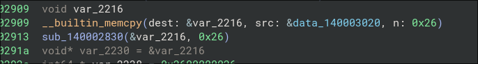

> Author: @HuskyHacks
> 
> *yawn* why am i so eeeeeeeeepy?

I was the 14th solve. Pretty cool. Windows executable, I immediately popped it into Binja. I entered the *main* function, and scoured for the main *action*. A lot of threads and sl*eeping*, and a lot of *red herrings* to waste time. There was, however, one *memcopy* that looked Suspicious:

It was the only one that was copying data over, and I went to look at it. It was `0x26` bytes before `0`s. I copy the hexadecimal data over to [cyberchef](https://gchq.github.io/CyberChef) and convert from hexadecimal. It was gibberish. However, it is 38 characters, so it **had** to be the flag. I had an inkling that HuskyHacks might use *XOR*, so I just threw a *XOR Brute Force* with `flag` and the crib, and we got the flag! (Key was `0xAA`)

<!-- 
vim:wrap:spell:linebreak:showbreak=\ \ :
-->
