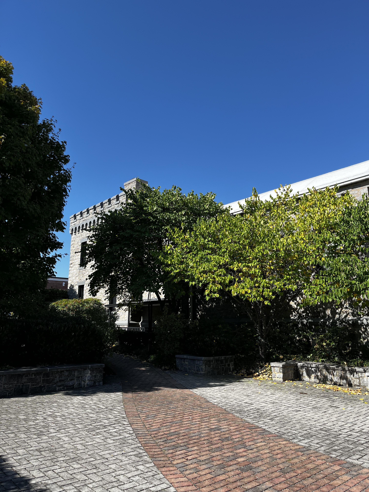
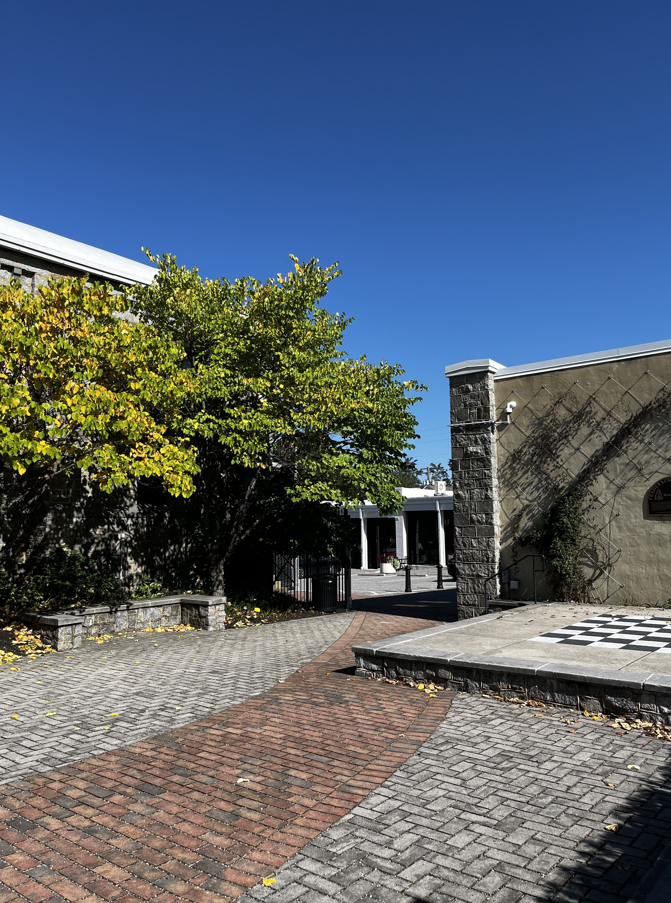
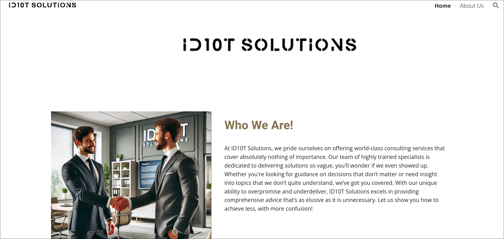
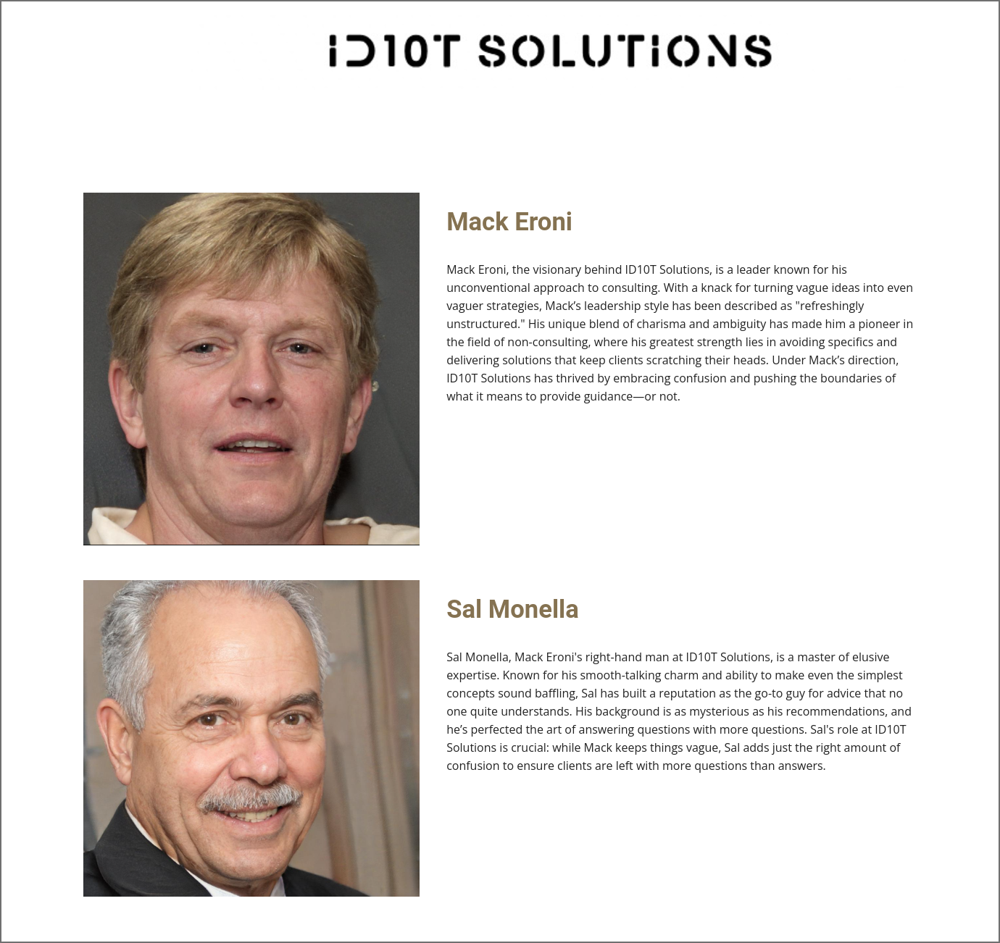
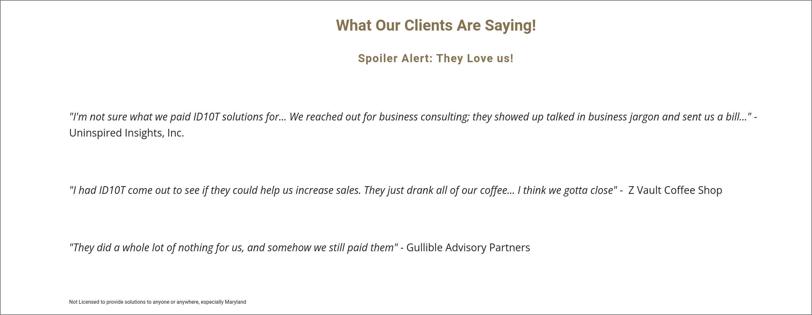
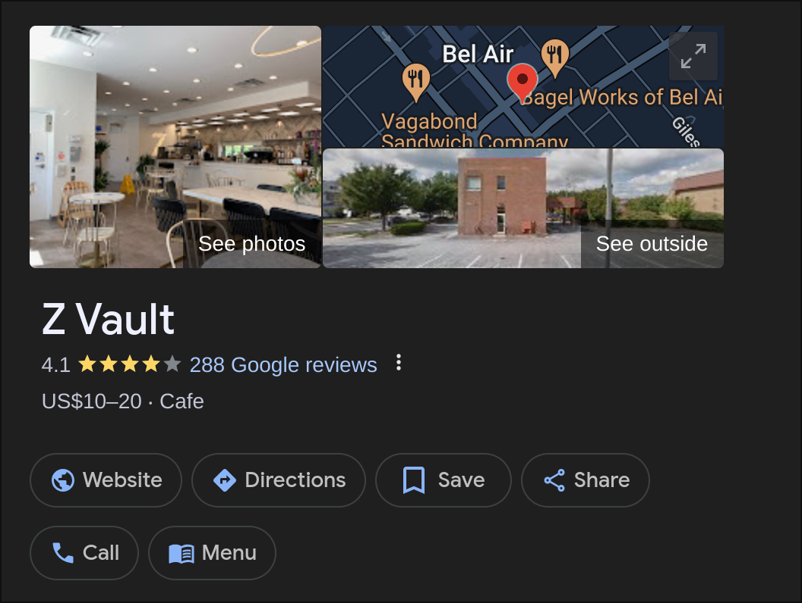
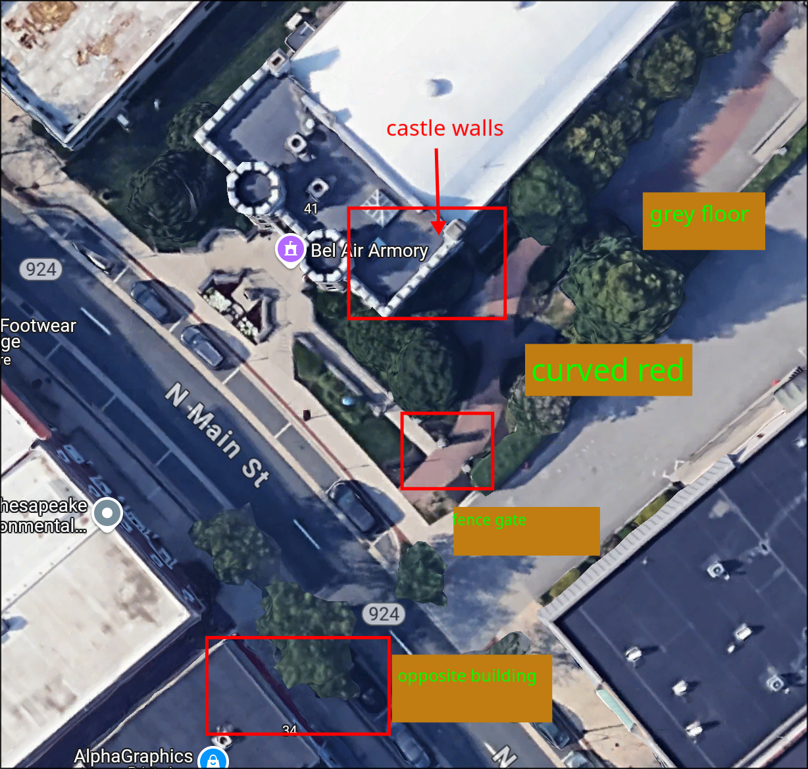
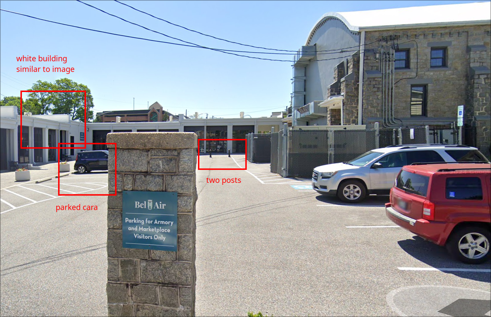

> Author: @Spyderwall
>
> Thanks for joining the help desk! Here's your first ticket of the day; can you help the client out?
>
> NOTE, this challenge uses a non-standard flag format. Enter the human-readable name of the location.

This is very very fun. There's a lot of funny names too, **but not all are fake**! It's specifically an OSINT task, so if there's no searching and too much digging, something's wrong. Firstly, I digged through the `.eml` file. There's a lot of begging for help. I have to admit, I was a bit lost trying to understand the file format at first, but now in hindsight all makes sense. The email has its contents and attached files encoded in _Base64_. To begin, the main email is an html file, that when decoded reads:

> Help Me IT!! My USB was stolen! I was headed into town for some work and stopped by a client's coffee shop to get work done. Everything was fine; I was working and drinking coffee. I got up to use the restroom; when I returned, I saw that my computer had been tampered with! All my work was closed out, and my flash drive with my projects was gone! I can't lose this; there was very important work on it! I thought the security tools you put in place would stop something like this!!
> When I was looking at the desktop, I noticed three new files that were not there before. I opened one to see if they were my files, but they are a jumbled mess. I can't make any sense of it. I think it is that "ran somewhere" that your team keeps warning us about. I still don't know what it is, but please reverse this and get my USB back. I can't believe this happened!
> I am attaching those files so you can fix them.
>
> -Mack Eroni
> President
>
> [Check out our new website!](https://archive.is/U3veE)
> 

The company logo here links to the second encoded file, which is an _PNG_ file of their logo. I started laughing when i saw *ID10T solutions*. A few important things to note here:

- Client's coffee shop
- Computer tampered within the short span of restroom break
- Three new files that are in *jumbled mess* (indicating encoding or encryption)
- Company website

Very nice. The next three files are all base64 encoded. Here are the contents:

## File one: '4e 6f 74 65.txt'

The filename is hex for: `note.txt`
> Hey There! You should be more careful next time and not leave your computer unlocked and unattended! You never know what might happen. Well in this case, you lost your flash drive. Don't worry, I will keep it safe and sound. Actually you could say it is now 'fortified'. You can come retrieve it, but you got to find it. I left a couple of files that should help.
> - Vigil Ante

Irritating fellow but has a point. Some important notes:

- 'fortified'
- The files left behind should help

## File two: '66 69 6e 64 20 69 74 20 79 65 74'

The filename is also hex, for `find it yet`. It is a JPEG image. I'll be honest, I actually wrongly copied the contents at first, rendering the decoding useless. I will skip this for now because the next file alone is enough to find the answer.

## File three: '69 6d 20 6e 65 61 72 62 79'

This file is named `im nearby`. Also another JPEG image, it is very useful!

I like this because there are many clues:

- grey brick pavement
- **curved** red brick pavement (with black bricks peppered)
- 'castle' looking building on the right
- 2 black posts in the distance
- there is a road with a car
- there is another white commercial single-story building opposite the road
- there is a fence-gate
- checkered flooring on the right *(this was more distracting to be honest)*
- a emblem or sign with *Frederick*	on it

## Company website

Let's look at the company website.

The about page is humouring, but it only confirms the CEO being *Mark Eroni*, the person who sent the email.

Back to the home page. Scrolling down, there are some *client feedbacks*.

> What Our Clients Are Saying!
> Spoiler Alert: They Love us!
> "I'm not sure what we paid ID10T solutions for... We reached out for business consulting; they showed up talked in business jargon and sent us a bill..." -Uninspired Insights, Inc.
>
> "I had ID10T come out to see if they could help us increase sales. They just drank all of our coffee... I think we gotta close" -  Z Vault Coffee Shop
>
> "They did a whole lot of nothing for us, and somehow we still paid them" - Gullible Advisory Partners
>
> Not Licensed to provide solutions to anyone or anywhere, especially Maryland

Hilarious, but look at the three *clients*:

1. Uninspired Insights, Inc.
2. Z Vault Coffee Shop
3. Gullible Advisory Partners

Remember the email? It mentioned the CEO visiting the *client at their coffee shop*. That has to be **Z Vault Coffee Shop**! It looks suspicious but not as obviously fake as the other client names. Also, something is off with the advisory focusing on *Maryland*.

## Time to search

To summarise:

- Client's coffee shop
- That is **Z Vault Coffee Shop**
- Computer tampered within the short span of restroom break
- Location is about a **10 minute radius**, especially if they are on foot
- *fortified*
- Location has to be somewhere with security
- grey brick pavement
- **curved** red brick pavement (with black bricks peppered)
- 'castle' looking building on the right
- 2 black posts in the distance
- there is a road with a car
- there is another white commercial single-story building opposite the road
- there is a fence-gate
- checkered flooring on the right
- a emblem or sign with *Frederick* on it
- *Maryland*

Here is a checklist to figure out what to search:

- [ ] Z Vault Coffee Shop
- [ ] 10 minute radius
- [ ] *fortified*
- [ ] 'castle' looking building on the right
- [ ] grey brick pavement
- [ ] **curved** red brick pavement (with black bricks peppered)
- [ ] 2 black posts in the distance
- [ ] there is a road with a car
- [ ] there is another white commercial single-story building opposite the road
- [ ] there is a fence-gate
- [ ] checkered flooring on the right
- [ ] a emblem or sign with *Frederick* on it
- [ ] *Maryland*

I googled *Z Vault Coffee Shop*, and behold:

It is a legitimate place! Moreover, it is in Bel Air, **Maryland**.

## Searching the maps

Let's use our favourite OSINT geographic surveillance technology: Google Maps. From the get-go, I can see the sporadic red pavements among the normal grey pavements. The lanes are mostly tiny, with buildings along both sides.

- [x] Z Vault Coffee Shop
- [ ] 10 minute radius
- [ ] *fortified*
- [ ] 'castle' looking building on the right
- [x] grey brick pavement
- [ ] **curved** red brick pavement (with black bricks peppered)
- [ ] 2 black posts in the distance
- [ ] there is a road with a car
- [ ] there is another white commercial single-story building opposite the road
- [ ] there is a fence-gate
- [ ] checkered flooring on the right
- [ ] a emblem or sign with *Frederick* on it
- [x] *Maryland*

> [!NOTE]
> A slide tangent: I actually missed the red pavements, and so went to search for *Fort Frederick Bel Air MD* and got *Fort Derrick MD*. It also had the same red and grey pavements, which sent me searching for awhile. Thankfully I gave up quickly, and went back to Bel Air, MD. I also searched for *Checkerboard* and *Chessboard* outdoor pavements, but got nowhere. Good thing they did not lead me down a rabbit hole of no return.

I noticed something odd - the red pavements were all *straight*, but in *im nearby*.jpg, the red pavement is **curved**. So there was no choice but to slowly sweep the location. Ten minutes later, I see a candidate: **Bel Air Armory**.

- [x] Z Vault Coffee Shop
- [x] 10 minute radius
- [x] *fortified*
- [x] 'castle' looking building on the right
- [x] grey brick pavement
- [x] **curved** red brick pavement (with black bricks peppered)
- [ ] 2 black posts in the distance
- [x] there is a road with a car
- [x] there is another white commercial single-story building opposite the road
- [x] there is a fence-gate
- [ ] checkered flooring on the right
- [ ] a emblem or sign with *Frederick* on it
- [x] *Maryland*

This looks promising. I continue to scan around, and look for the street view. Unfortunately I am unable to get the view I wanted, but I saw something else.

This was the back of that same armory building. The *road* is the carpark behind, and the *buildings opposite* is the Armory Market. It revealed the two black posts, and fence gates as well.

- [x] Z Vault Coffee Shop
- [x] 10 minute radius
- [x] *fortified*
- [x] 'castle' looking building on the right
- [x] grey brick pavement
- [x] **curved** red brick pavement (with black bricks peppered)
- [x] 2 black posts in the distance
- [x] there is a road with a car
- [x] there is another white commercial single-story building opposite the road
- [x] there is a fence-gate
- [ ] checkered flooring on the right
- [ ] a emblem or sign with *Frederick* on it
- [x] *Maryland*

I held my breathe and entered the flag: *Bel Air Armory*. Success.

