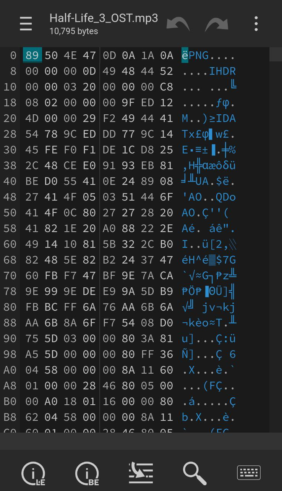
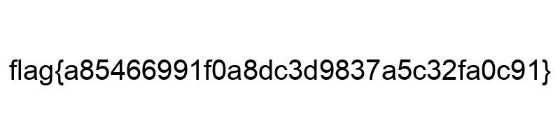

> Author: @JohnHammond
> Don't believe everything you see on the Internet!
> Anyway, have you heard this intro soundtrack from Half-Life 3?

This challenge was quick and easy! I did it while on the way to celebrate my sister's birthday.

Half life 3 OST. Hilarious. As with all song files, I immediately threw it into a spectrogram to find any hidden messages. Other than bird noises, nothing.

I guess the next is to find an actual file embedded inside. So I went to [hexed, an online hex editor](https://hexed.it) and sure enough, I saw those three letters: *P, N, G*.

I quickly went to my phone's file browser, and renamed the extension to *.png*, and voila!

