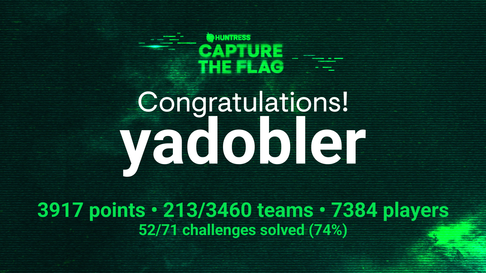

Huntress CTF 2024 was an exhilarating experience, held throughout October in celebration of Cybersecurity Awareness Month. With fresh challenges released daily, it offered a dynamic and engaging way to explore the field of cybersecurity. As my first-ever CTF, it was a manageable yet rewarding dive into topics like reverse engineering and problem-solving. Although designed as a team challenge, I tackled it solo, which made the learning experience even more personal and gratifying.

One standout for me was the [OSINT challenge](ran_somewhere), which cleverly incorporated real-world elements into the puzzle. It was a refreshing change of pace and a reminder of the practical applications of cybersecurity skills beyond the digital realm. The challenge pushed me to think creatively and connect seemingly unrelated pieces of information—skills vital in cybersecurity investigations.

Unfortunately, I fell ill during the final week, leaving some challenges unfinished, but the journey up until then was nothing short of transformative. The camaraderie with fellow contestants and Huntress staff added a vibrant social element to the event. That said, I quickly understood why many participants chose to disable direct messages; it was a bit disheartening to see people skip ahead and seek answers without attempting to progress naturally.

Below is a checklist of the challenges I tackled during the event. Striked-out entries are challenges I could not complete due to illness. Checked entries indicate completed write-ups, while the rest are pending write-ups, which I plan to finish soon:

##### Tuesday, October 1, 2024    
   - [ ] [read_the_rules](read_the_rules)
   - [ ] [technical_support](technical_support)
   - [ ] [more_challenges_tomorrow](more_challenges_tomorrow)
   - [x] [matryoshkaQR](matryoshkaqr)
   - [x] [base64by32](base64by32)
   - [x] [too_many_bits](too_many_bits)
   - [x] [strange_calc](strange_calc)

##### Wednesday, October 2, 2024
   - [x] [No Need For Brutus](no_need_for_brutus)
   - [x] [Red Phish Blue Phish](red_phish_blue_phish)

##### Thursday, October 3, 2024
   - [x] [cattle](cattle)
   - [x] [Nightmare on Hunt Street (Bundle)](nightmare_on_hunt_street_(bundle))
   - [x] [russian_roulette](russian_roulette)

##### Friday, October 4, 2024
   - [x] [whamazon](whamazon)
   - [x] [malibu](malibu)

##### Saturday, October 5, 2024
   - [x] [unbelievable](unbelievable)
   - [ ] ~~ocean_locust~~

##### Sunday, October 6, 2024
   - [x] [txt_message](txt_message)
   - [x] [discount_programming_devices](discount_programming_devices)

##### Monday, October 7, 2024
   - [x] [mimi](mimi)
   - [ ] ~~system_code~~

##### Tuesday, October 8, 2024
   - [x] [zimmer_down](zimmer_down)
   - [x] [ran_somewhere](ran_somewhere)
   - [ ] [base_-p-](base_p)
   - [x] [mystery](mystery)

##### Wednesday, October 9, 2024
   - [x] [GoCrackMe1](gocrackme1)
   - [x] [i_cant_ssh](i_cant_ssh)

##### Thursday, October 10, 2024
   - [ ] ~~GoCrackMe2~~
   - [x] [finders_fee](finders_fee)

##### Friday, October 11, 2024
   - [ ] ~~GoCrackMe3~~
   - [x] [typo](typo)

##### Saturday, October 12, 2024
   - [ ] ~~x-ray~~
   - [ ] ~~zulu~~

##### Sunday, October 13, 2024
   - [ ] ~~ObfuscationStation~~
   - [ ] [Little Shop Of Hashes (Bundle)](little_shop_of_hashes_(bundle))

##### Monday, October 14, 2024
   - [ ] [keyboard_junkie](keyboard_junkie)
   - [ ] [HiddenStreams](hiddenstreams)

##### Tuesday, October 15, 2024
   - [ ] [sekiro](sekiro)
   - [ ] [transmissions](transmissions)

##### Wednesday, October 16, 2024
   - [ ] [echo_chamber](echo_chamber)
    
##### Thursday, October 17, 2024
   - [ ] [linux_basics](linux_basics)
   - [x] [the_void](the_void)
   - [ ] ~~moveable~~
   - [x] [baby buffer overflow](baby_buffer_overflow)

##### Friday, October 18, 2024
   - [ ] [eepy](eepy)
   - [ ] [permission_to_proxy](permission_to_proxy)

##### Saturday, October 19, 2024
   - [ ] [stack_it](stack_it)
   - [ ] ~~eco_friendly~~

##### Sunday, October 20, 2024
   - [ ] [y2j](y2j)
   - [ ] ~~splunk_ii~~

##### Monday, October 21, 2024
   - [ ] ~~rsa_decrypt~~
   - [ ] [helpfuldesk](helpfuldesk)

##### Tuesday, October 22, 2024
   - [ ] ~~rustline~~
   - [ ] [plantopia](plantopia)

##### Wednesday, October 23, 2024
   - [ ] [ping_me](ping_me)
   - [ ] ~~time_will_tell~~

##### Thursday, October 24, 2024
   - [ ] ~~knights_quest~~
   - [ ] ~~ancient_fossil~

##### Friday, October 25, 2024
   - [ ] ~~pillow_fight~~
   - [ ] [feedback](feedback)

##### Saturday, October 26, 2024
   - [ ] ~~thats_life~~

##### Sunday, October 27, 2024
   - [ ] [revenge_of_dpd](revenge_of_dpd)

##### Monday, October 28, 2024
   - [ ] ~~rusty_bin~~

##### Tuesday, October 29, 2024
   - [ ] ~~in_plain_sight~~

##### Wednesday, October 30, 2024
   - [ ] ~~zippy~~

##### Thursday, October 31, 2024
   - [ ] ~~Palimpsest~~

Despite these setbacks, Huntress CTF 2024 was a fantastic introduction to the world of CTFs and an inspiring reminder of the creativity and collaboration at the heart of cybersecurity. Special thanks to ChatGPT for brainstorming and importantly for generating scripts quickly when given the appropriate goals, which helped reduce time wasted trying to debug scripts. Definitely a help especially since I also had school work to complete.

<!-- 
vim:wrap:spell:linebreak:showbreak=\ \ :
-->
