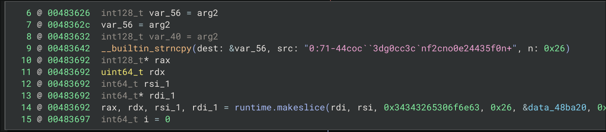
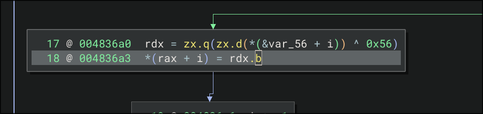

> Author: @HuskyHacks
> 
> TENNNNNN-HUT!
> 
> Welcome to the Go Dojo, gophers in training!
> 
> Go malware is on the rise. So we need you to sharpen up those Go reverse engineering skills. We've written three simple CrackMe programs in Go to turn you into Go-binary reverse engineering ninjas!
> 
> First up is the easiest of the three. Go get em!

First, strings. Nothing. Then straight to Binary Ninja. Since this is a *Golang* programme, there was a lot of debugging info available. I quickly went to the main function, and then saw a string being copied to a buffer.

Then, a loop that `XOR`s each character by `0x56`. 

Throw this two information into [CyberChef](https://gchq.github.io/CyberChef) and done.

