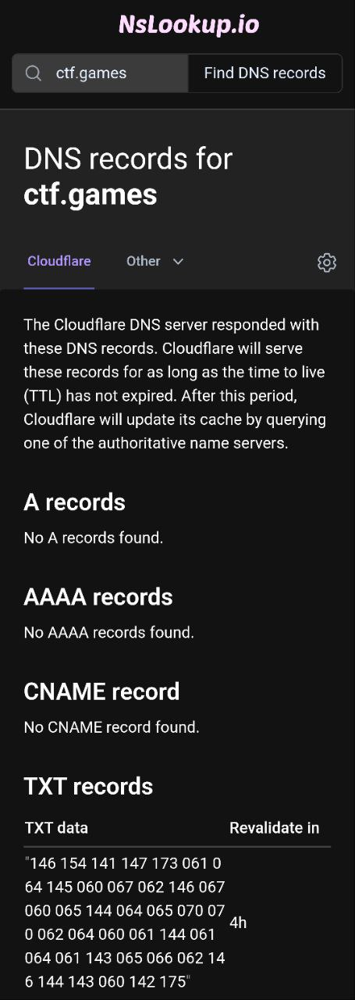

> Author: @JohnHammond
>
> Hmmm, have you seen some of the strange DNS records for the ctf.games domain? One of them sure is odd...
(In the task, [od](https://en.wikipedia.org/wiki/Od_(Unix))d linked to the wikipedia article for the `od` programme)

This was a fun warm-up. Using [an online DNS record search](https://www.nslookup.io/), I got this TXT record for `ctf.games`:

passing it through an octal-to-ascii converter gave the flag.

