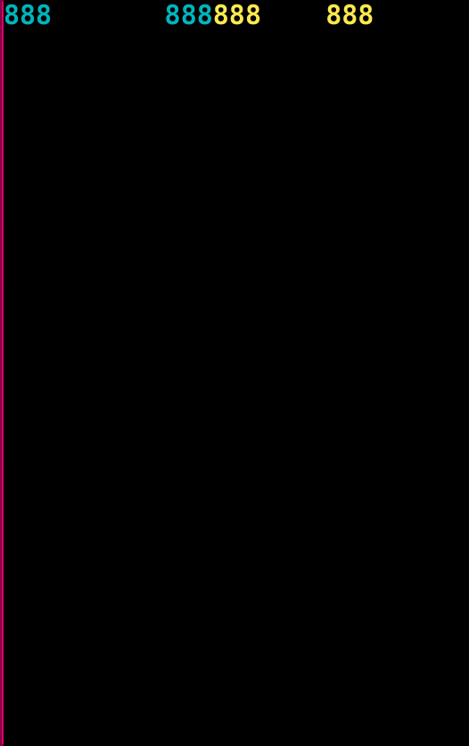
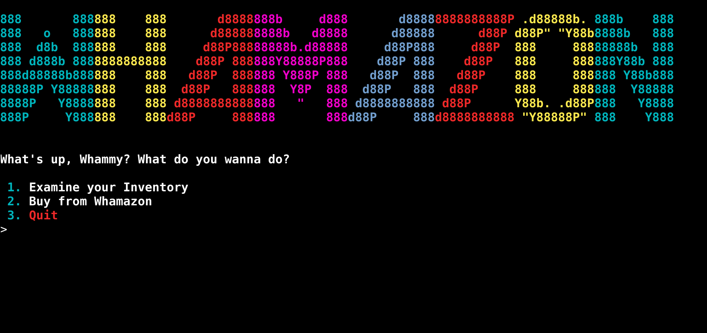

> Author: @JohnHammond
>
> Wham! Bam! Amazon is entering the hacking business! Can you buy a flag?

A GoTTY terminal on the web is created. Strangely with **Dark Reader** plugin the display was broken, so I had to do it on incognito. 

It is an interactive terminal with numbers to choose options presented.

## Buy the flag?

First off, trying to buy the flag. It costs $1000000000 and I apparently only have 50 bucks. I had to manipulate and spend negative money to earn money.

## Maths

I try buying an apple. Apple costs 3 bucks, and I am asked how much I want. I go straight for the `-1` and sure enough, I now have **53 bucks**. eheh. I go straight and bought another **-1000000000** apples and became rich. _Great deal buying an Apple from Whamazon._

## Scissors Paper Stone

Next is Rock Paper Scissors (or where I'm from, _scissors, paper, stone_). Apparently when I try to purchase this, I need to battle the terminal. It tries to "psych" me by saying it will not choose _Rock_, so I choose Rock. It choose Paper. Then again I choose Paper and it chose Paper. Strange. Then I chose Scissors and it chose Paper. It lost. What. Then it gave me the flag.

## Flag?

Yes that's it. I go to my inventory and there the flag is. Very fun warm-up!

